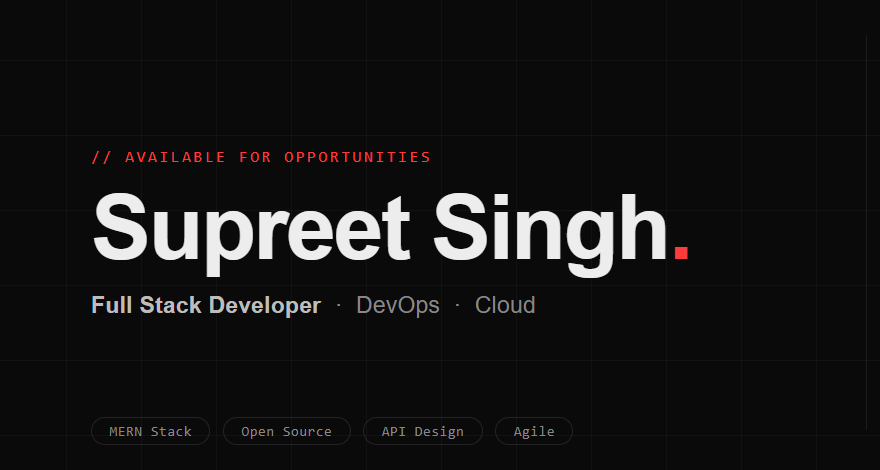

<!--Banner-->

<!--Night Owl image-->

  

<!--Header Name-->
#  ɪ'ᴍ Supreet Singh! 
*Digital Craftsman (Developer / Programmer)*
  

<!--Start Intro-->               

I am a Full Stack Developer passionate about building scalable web applications and exploring modern software practices. My core expertise includes JavaScript, TypeScript, React.js, Node.js, Java, Spring Boot, Redis, SQL, REST APIs, and Docker, with strong interest in DevOps, CI/CD pipelines, deployment automation, and system reliability 

- 💻 Building full-stack applications with modern technologies
- 🌱 Currently learning DevOps tools, cloud workflows, and backend scalability
- ⚡ Focused on clean architecture, performance, and problem solving
- 🎨 Also experienced with Adobe Photoshop, Premiere Pro, and After Effects
- 🐧 Comfortable working in Linux environments
- ❤ Open to collaboration, learning, and impactful tech work
- 💁‍♂️ Trusted member and Moderator at [DEV Community](https://dev.to)
- 🏙 A lifetime insider and Mentor at [Exercism](https://exercism.org/profiles/SupreetSinghDev).
- ✍ I write technical blogs, You can visit my blog site at [DEV](https://dev.to/dev_Supreet).
- ❤ Contributing to Open Source.
- 💻 Visit my [Portfolio](https://Supreet.com) for more details about me.
<!--End Intro-->

<!--Profile Count Badge-->

  

---

<!--Languages and Tools Section-->       
<h2 align="center">💻Tᴇᴄʜ sᴛᴀᴄᴋ & Lᴀᴛᴇsᴛ ʙʟᴏɢs</h2> 

                         

 

<h3 align="left">Current Learning</h3>
<ul align="left">
  <li>Advancing my skills in Java, Spring Boot, and scalable backend architecture.</li>
  <li>Exploring DevOps practices, CI/CD pipelines, Docker, and deployment workflows.</li>
  <li>Strengthening React.js patterns and modern state management techniques.</li>
  <li>Improving system design, API performance, and database optimization.</li>
  <li>Expanding cloud knowledge with AWS and modern infrastructure tools.</li>
</ul>

  
<h3 align="left">Latest Blog Posts</h3>
<ul align="left">
  <li><a href="https://dev.to/dev_Supreet/storyblok-mcp-server-let-ai-agents-manage-your-content-3jaa">🔥Storyblok MCP Server: Let AI Agents Manage Your Content 🤖</a></li>
  <li><a href="https://dev.to/dev_Supreet/pulstack-deploy-your-static-site-to-s3-or-github-in-1-min-5cin">🔥Pulstack: Deploy your static site to S3 or GitHub in <1 min🙂</a></li>
  <li><a href="https://dev.to/dev_Supreet/i-tried-out-qodos-new-embed-model-qodo-embed-1-40h5">I Tried Out Qodo's New Embed Model Qodo-Embed-1🤯</a></li>
</ul>
 
 
 
 

<!--Trophies Section-->   
<h2 align="center">🏆 Gɪᴛʜᴜʙ Tʀᴏᴘʜɪᴇs 🏆</h2>

  <a href="https://github.com/SupreetSinghDev">
    <picture>
      <source media="(prefers-color-scheme: dark)" srcset="https://github-profile-trophy-ruddy.vercel.app/?username=SupreetSinghDev&no-bg=true&row=2&column=6&margin-w=20&margin-h=20&theme=monokai">
      <source media="(prefers-color-scheme: light)" srcset="https://github-profile-trophy-ruddy.vercel.app/?username=SupreetSinghDev&no-bg=true&row=2&column=6&margin-w=20&margin-h=20">
      
    </picture>
  </a>

  

 

<!--Github stats Table--> 
<h2 align="center">📊 Gɪᴛʜᴜʙ Sᴛᴀᴛs 📊</h2>

<table width="100%">
  <tr>
    <td width="50%">
      <h3 align="center"><strong>Gɪᴛʜᴜʙ Sᴛᴀᴛs</strong></h3>
      

        
      

    </td>
    <td width="50%">
      <h3 align="center"><strong>Sᴛʀᴇᴀᴋ Sᴛᴀᴛs</strong></h3>
      

        
      

    </td>
  </tr>
  <tr>
    <td width="50%">
      <h3 align="center"><strong>Lᴀᴛᴇsᴛ Pʀᴏᴊᴇᴄᴛ</strong></h3>
      

        
      

    </td>
    <td width="50%">
      <h3 align="center"><strong>Tᴏᴘ Cᴏɴᴛʀɪʙᴜᴛɪᴏɴs</strong></h3>
      

        
      

    </td>
  </tr>
</table>

 

<h2 align="center">📈 Cᴏɴᴛʀɪʙᴜᴛɪᴏɴ Gʀᴀᴘʜ 📈</h2>

    

---

<h2 align="center">🌟 Tʜᴏᴜɢʜᴛ ᴏғ ᴛʜᴇ Dᴀʏ 🌟</h2>

    

<!--ENDS_HERE_QUOTE_CARD-->

<!--Contact Section--> 

<h2 align="center">🤝 Cᴏɴɴᴇᴄᴛ Wɪᴛʜ Mᴇ 🤝 </h2>

  

 

<!--Buy me a coffee-->

<!--Footer--> 

  

